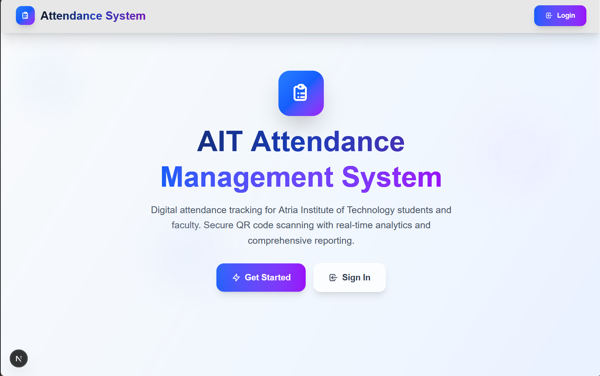
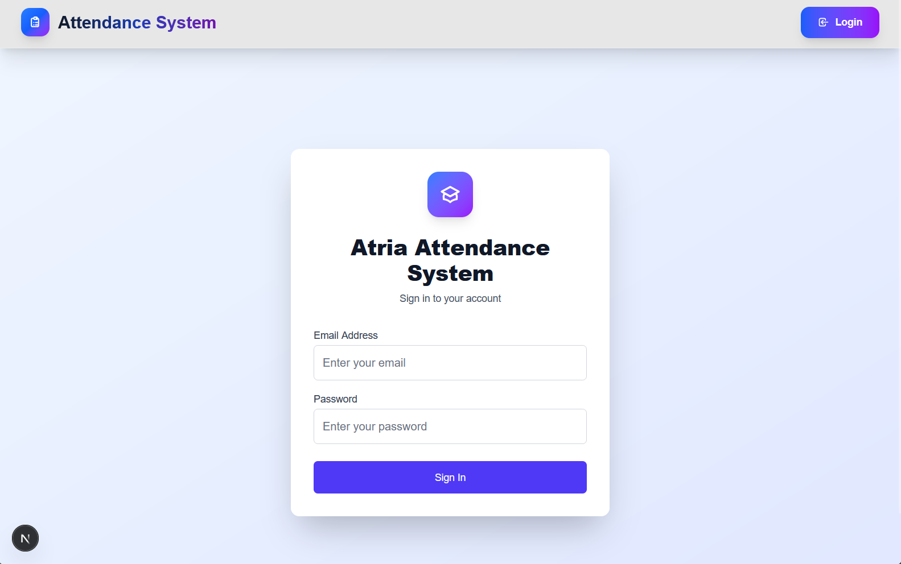
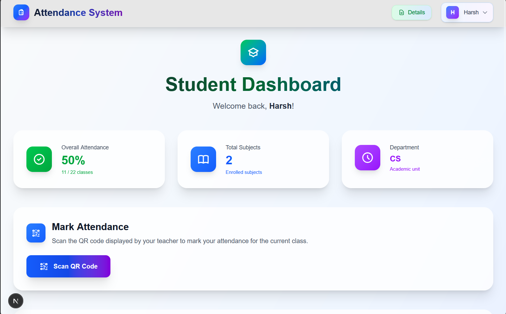
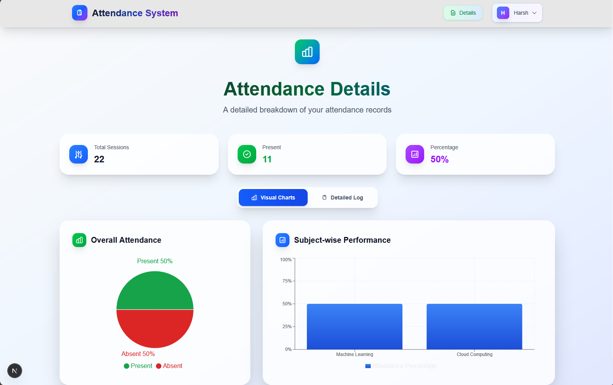
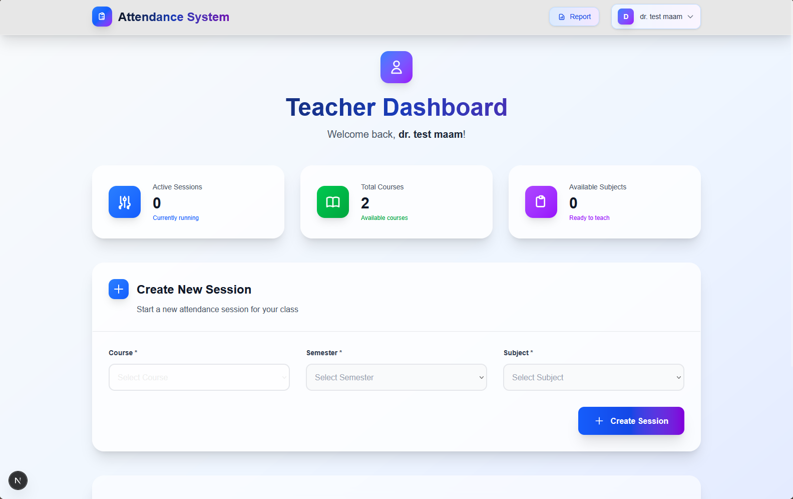
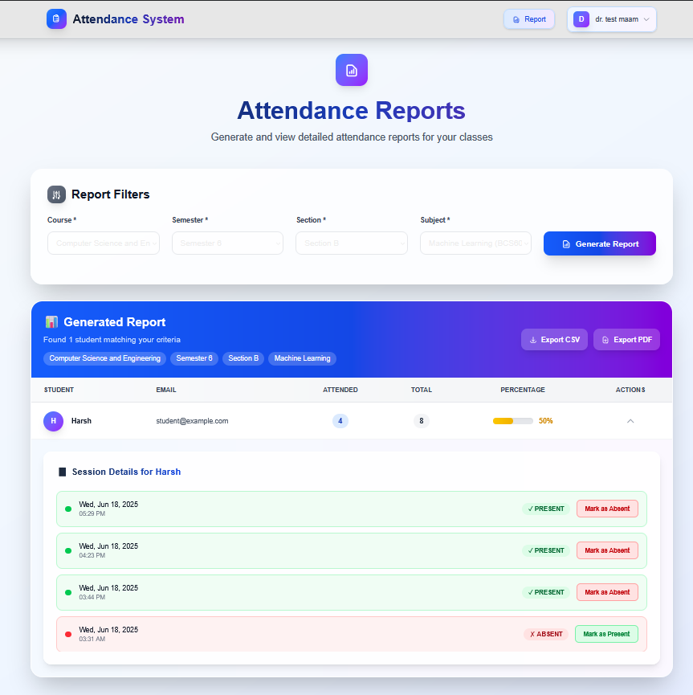

<picture>
<source media="(prefers-color-scheme: dark)" srcset="./public/logo-light.svg">
<source media="(prefers-color-scheme: light)" srcset="./public/logo-dark.svg">

</picture>
<h1>Atria Attendance System</h1>

  A modern, responsive attendance management system built with Next.js, Firebase, and QR code technology. This system provides role-based access for students, teachers, and administrators to efficiently manage attendance tracking in educational institutions.

  
  
  
  

## 📸 Screenshots

  
  &nbsp;
  

  
  &nbsp;
  

  
  &nbsp;
  

## 🌟 Core Features

### 📱 **Multi-Role Dashboard System**

- **Student Dashboard**: Scan QR codes, view attendance history, and track academic progress.
- **Teacher Dashboard**: Create sessions, generate unique QR codes, and monitor attendance in real-time.
- **Admin Dashboard**: Manage all users, configure academic settings, and view system-wide analytics.

### 🔐 **Authentication & Security**

- Secure user login and session management powered by **Firebase Authentication**.
- Strict **role-based access control** ensures users only see what they're supposed to.
- Protected routes automatically redirect unauthorized users.

### 📊 **QR Code Technology**

- **Real-time QR code generation** for each attendance session.
- A **mobile-optimized QR scanner** using the device's camera for quick and easy check-ins.
- Attendance is marked automatically and instantly upon a successful scan.

### 📈 **Analytics & Reporting**

- **Comprehensive attendance statistics** are available on each dashboard.
- **Visual charts and progress indicators** make it easy to understand attendance data at a glance.
- Detailed **subject-wise attendance breakdown** and exportable reports.

### 🎨 **Modern UI/UX**

- A **fully responsive, mobile-first design** that looks great on any device.
- Styled with **Tailwind CSS** for a clean, modern aesthetic with beautiful gradients.
- Smooth loading animations and interactive components enhance the user experience.

## 🛠️ Technology Stack

- **Frontend**: Next.js 15.3.3, React 19
- **Styling**: Tailwind CSS 4
- **Backend & Database**: Firebase (Authentication, Firestore)
- **QR Codes**: A combination of `html5-qrcode`, `qrcode`, and `react-qr-code`.
- **Charts**: Recharts
- **Forms**: React Hook Form
- **Build Tools**: Turbopack, ESLint

## 👥 User Roles

The system is designed with three distinct user roles, each with a tailored experience:

### Student

- Scan QR codes to mark attendance for classes.
- View personal attendance history and overall statistics.
- Track academic progress across different subjects.

### Teacher

- Create and manage attendance sessions for their classes.
- Generate unique, secure QR codes for each session.
- Monitor real-time attendance as students scan in.

### Administrator

- Full control over user management (adding, editing, and removing students and teachers).
- Configure system-wide academic settings.
- View high-level analytics and manage attendance policies.

## 📄 License

This project is licensed under the MIT License.

## 📞 Contact

If you have any questions or want to get in touch, please feel free to reach out.

## 🧪 Sample

You can check out the sample website using the link and credentials provided below:
- Website: https://ait-attendance.vercel.app
- Credentials:
- Student: student@example.com
- Teacher: teacher@example.com
- Password: 123456

---

Built with ❤️ for Atria Institute of Technology

